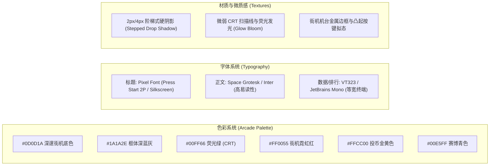

# 复古街机像素风（EdgePlay）网页设计方案与 Stitch 出图图纸规格书

> [!NOTE]
> 本方案严格根据您确认的设计偏好进行定制：
> - **视觉风格**：复古街机像素风（Retro Pixel / 8-bit & 16-bit 街机机台美学与 CRT 扫描线质感）。
> - **首页布局**：宽屏精选轮播（Hero Banner） + 分类胶囊栏 + 热门网格。
> - **播放详情页**：影院剧场模式（Cinema Mode 居中大画布 + 侧边排行榜与相关推荐）。
> - **多端支持**：包含专门的**移动端响应式大厅与触屏虚拟手柄容器**规格。
> 文档末尾附带**可直接复制喂给 Stitch 的高精度提示词（Prompt）**。

---

## 1. 设计系统与视觉规范（Design System）



### 1.1 色彩定义（Color Tokens）
* **背景主色（Background）**：`#0A0A14`（纯黑与暗深蓝过渡，模拟昏暗街机厅环境）
* **表面/卡片底色（Surface）**：`#161626`（机台控制台暗灰）
* **边框与阴影色（Borders & Stepped Shadows）**：
  * 主边框：`#2E2E48`（4px 硬边框，无平滑圆角，纯像素阶梯感）
  * 高亮描边：`#FF0055`（Neon Pink） / `#00FF66`（CRT Green）
* **功能状态色（Accents）**：
  * **主行动色（Primary Action - 投币/开始）**：`#FFCC00`（Coin Gold）搭配 `#FF0055`（Arcade Red）
  * **成功/联机在线（Online/Sync）**：`#00FF66`（Terminal Green）
  * **高分/排行第一（Top Rank）**：`#FFD700`（Gold Foil）
  * **信息/提示（Cyan Highlight）**：`#00E5FF`

### 1.2 像素拟态组件规范（Pixel Component Specs）
1. **按键（Arcade Buttons）**：
   - 形状：4px 像素倒角，带 4px 纯黑/深色底部硬阴影（Offset `box-shadow: 0 4px 0 #000`）。
   - 按下状态（Active）：无过渡平滑动画，位置瞬间下移 4px，阴影归零，模拟真实微动开关按键回弹。
2. **状态卡片（Game Cards）**：
   - 包含扫描线纹理（Scanline Overlay: 20% 不透明度黑横条纹）。
   - Hover 时触发霓虹彩色发光描边（`box-shadow: 0 0 12px #00E5FF`）并在角落浮现 "PRESS START" 像素浮标。

---

## 2. 页面 1：桌面端首页大厅（Home Discovery Hub）


### 2.1 整体网格布局（1440px 视口基准）

```
┌────────────────────────────────────────────────────────────────────────┐
│ 🕹️ RETRO PLAY   [ 🔍 > SEARCH GAME... ]   [🪙 TOKENS: 120]  [👾 PLAYER1]│ (Top Nav)
├────────────────────────────────────────────────────────────────────────┤
│ ┌──────────────────────────────────────────────┐ ┌───────────────────┐ │
│ │ 📺 FEATURED ARCADE CABINET (HERO CAROUSEL)    │ │ 🏆 DAILY HIGH     │ │
│ │                                              │ │    SCORES         │ │
│ │  [ GAME TITLE: CYBER RUNNER 1984 ]           │ │ 1. ACE - 999,400  │ │
│ │  ▶ [ INSERT COIN & PLAY ]   ⭐ 4.9 (2.4k)    │ │ 2. NEO - 840,120  │ │
│ └──────────────────────────────────────────────┘ └───────────────────┘ │
├────────────────────────────────────────────────────────────────────────┤
│ [🕹️ 全部] [⚔️ 动作闯关] [🧩 经典益智] [🏎️ 像素赛车] [👥 双人同屏] [🎲 街机]    │ (Category Pills)
├────────────────────────────────────────────────────────────────────────┤
│ ┌──────────────┐ ┌──────────────┐ ┌──────────────┐ ┌──────────────┐    │
│ │ 🎮 GAME CARD │ │ 🎮 GAME CARD │ │ 🎮 GAME CARD │ │ 🎮 GAME CARD │    │
│ │ 8-Bit Pixel  │ │ Street Fight │ │ Tetris DX    │ │ Metal Slug   │    │
│ │ ⭐ 4.8 12k   │ │ ⭐ 4.9 34k   │ │ ⭐ 4.7 89k   │ │ ⭐ 5.0 56k   │    │
│ └──────────────┘ └──────────────┘ └──────────────┘ └──────────────┘    │
│                                                                        │
│ 📢 [ MARQUEE: USER "PIXEL_KING" JUST BEAT THE HIGHSCORE IN 2048! ]      │
└────────────────────────────────────────────────────────────────────────┘
```

### 2.2 模块详细视觉定义
1. **顶栏导航（Arcade Header）**：
   - **Logo**：左侧亮黄色 + 霓虹红双色像素立体字 `EDGEPLAY // RETRO ARCADE`。
   - **终端搜索框**：仿 DOS/UNIX 命令行风格，深黑底色，前面带绿色闪烁光标 `> `，提示文字为 `SEARCH 1,000+ CLASSIC TITLES...`。
   - **右侧玩家区**：金币积分计数器（带投币口图形 🪙）+ 8-bit 头像框与 VIP 勋章。
2. **Hero 精选推荐轮播（Cabinet Banner）**：
   - 外框设计为**复古街机框体彩绘边缘**。
   - 画面呈现正在运行的游戏动态演示，右下方有硕大的红黄立体像素按钮 **`[ INSERT COIN - PLAY NOW ]`**。
   - 右侧配套“今日街霸榜 Top 3”，实时翻滚滚动。
3. **分类胶囊栏（Category Pills）**：
   - 像素图标 + 文字，未激活为深灰底深边框，Hover 变为荧光绿边框与亮绿字符。
4. **游戏卡片网格（Dense Game Grid）**：
   - 4~5 列响应式流式布局。卡片包含：16:10 游戏像素截图、游戏标题、分类标签、游玩次数（如 `45.2k PLAYS`）、星级评价。

---

## 3. 页面 2：游戏试玩与详情页（影院剧场模式 Cinema View）


### 3.1 剧场模式布局排版

```
┌────────────────────────────────────────────────────────────────────────┐
│ < BACK TO ARCADE              🎮 SPACE SHOOTER DX           [⚙️ SETTINGS]│
├────────────────────────────────────────┬───────────────────────────────┤
│                                        │ 🏆 TOP ARCADE PILOTS          │
│                                        │  #1 👑 CYBER_SAMURAI 1,240,000│
│      📺 CRT MONITOR GAME CANVAS         │  #2 🥈 RETRO_GIRL     980,500 │
│                                        │  #3 🥉 8BIT_HERO      872,000 │
│      [ 16:9 游戏实时运行画面 / IFRAME ]   │  ---------------------------- │
│                                        │  💬 LIVE COMMENTS (48)        │
│                                        │  "Best game ever played!"     │
├────────────────────────────────────────┤                               │
│ [⛶ 全屏] [🔊 音量] [🔄 重置] [💾 云存档已同步]│ 🎁 SPONSORED ARCADE EVENT     │
├────────────────────────────────────────│  [ 合规像素风格活动/广告赞助位 ] │
│ 🕹️ 操作指南: [W/A/S/D] 移动 | [J] 射击   │                               │
│ ❤️ 收藏 (1.2k)   👍 推荐 (98%)  🔗 分享 │ 🎮 相似投币推荐 (RELATED)     │
└────────────────────────────────────────┴───────────────────────────────┘
```

### 3.2 关键交互组件规范
1. **CRT 机台屏幕（Game Canvas Frame）**：
   - 画布四周具有深灰凸起边框与四角螺丝细节。
   - 右上角提供 **`CRT SCANLINES [ON/OFF]`** 切换按钮，满足部分玩家对清晰度或怀旧感的自由选择。
2. **控制快捷栏（Arcade Tool Strip）**：
   - 包含：全屏（Fullscreen）、一键静音、重启按键、按键映射说明抽屉、以及**云存档状态指示灯**（绿色闪烁表示“正在同步至 D1/R2”，常亮表示“已保存”）。
3. **右侧排行榜面板（Arcade Leaderboard Table）**：
   - 榜首显示金色皇冠像素图标与闪烁称号。
   - 底部固定当前登录用户的排名卡片（如 `YOUR RANK: #42 - 120,400 PTS`），并带有“刷新重试”引导。

---

## 4. 页面 3：移动端自适应与虚拟街机按键（Mobile View）


针对手机和移动平板，需要特别设计**竖屏布局**以及在没有物理键盘时的**触屏虚拟十字键与 A/B 键**。

### 4.1 移动端布局方案

```
┌─────────────────────────┐
│ 🕹️ EDGEPLAY   [🔍] [🪙] │ (移动端紧凑顶栏)
├─────────────────────────┤
│ ┌─────────────────────┐ │
│ │ 📺 移动端轮播横幅    │ │ (16:9 触屏滑动轮播)
│ └─────────────────────┘ │
├─────────────────────────┤
│ [全部] [闯关] [街机] [赛车] │ (横向可拖动分类胶囊)
├─────────────────────────┤
│ ┌──────────┐ ┌──────────┐│
│ │ 🎮 CARD  │ │ 🎮 CARD  ││ (移动端双列卡片瀑布流)
│ └──────────┘ └──────────┘│
├─────────────────────────┤
│ 🕹️ 游戏中模式 (竖屏手柄模式):│
│ ┌─────────────────────┐ │
│ │    游戏视口窗口     │ │
│ └─────────────────────┘ │
│   ┌───┐         (B) (A) │ (仿 Game Boy / 街机机台手柄)
│ ┌─┘   └─┐     (Y) (X)   │
│ │  ◀ ▶  │               │
│ └─┐   ┌─┘    [SELECT]   │
│   └───┘       [START]   │
├─────────────────────────┤
│ 🏠首页   🕹️排行   💾云存档  👤我│ (底部像素风悬浮导航 Tab)
└─────────────────────────┘
```

### 4.2 触屏专属体验细节
1. **触屏虚拟手柄（Virtual Touch Controller）**：
   - 当检测为触屏且游戏需要按键时，下半部分自动展开触控区。
   - 带有轻微触觉震动反馈（Web Vibration API: `navigator.vibrate(15)`）。
2. **底部悬浮像素导航栏（Bottom TabBar）**：
   - 图标为 8-bit 精灵图标（Home 投币机、Trophy 奖杯、Floppy 软盘云存档、Avatar 角色）。

---

## 5. Stitch 直接出图 Prompts（可直接复制使用）

你可以将以下精心优化的 Prompt 直接输入给 **Stitch**，生成高精度设计图：

### Prompt 1: 桌面端首页大厅 (Home Discovery Portal)
```text
UI/UX Design for a modern retro pixel-art gaming web portal named "EdgePlay".
Desktop viewport 1440x900, dark mode arcade theme.
Style: 8-bit and 16-bit retro arcade machine aesthetic meets modern polished web design.
Color scheme: Deep space black (#0A0A14), CRT neon phosphor green (#00FF66), arcade magenta (#FF0055), and coin gold (#FFCC00). 
Header: Retro pixel logo "EDGEPLAY", terminal-style search bar with blinking green cursor "> SEARCH GAMES...", coin counter badge "🪙 1,250", and retro 8-bit avatar.
Hero Section: Large wide carousel banner styled like an authentic CRT arcade cabinet display showcasing featured action game with a bold beveled pixel button "[ INSERT COIN & PLAY ]" and star rating. Next to it is a "Today's High Scores" retro leaderboard ticker.
Category bar: Chunky beveled pixel pills for categories (Arcade, Action, Puzzle, Retro 8-Bit, 2-Player).
Body: Responsive 4-column game card grid with stepped drop shadows, scanline overlays, pixel game thumbnails, badge labels, and play counters.
Footer: Retro LED marquee displaying live ticker of player high-score achievements.
Pixelated bevels, crisp stepped borders, neon glow accents, high fidelity, 4k.
```

### Prompt 2: 影院剧场模式游戏试玩与详情页 (Game Player Screen)
```text
UI/UX Design for a web game theater / player detail page for retro gaming platform "EdgePlay".
Desktop layout 1440x900.
Main Area (Center): Large 16:9 arcade cabinet monitor frame displaying an active retro space shooter game with toggleable CRT scanlines. Below the screen is an arcade control strip with pixel buttons: Fullscreen, Mute/Unmute, Reset, Keybinding guide (W/A/S/D + J/K), and a pulsing green "CLOUD SAVE SYNCED" indicator.
Below Controls: Game title "SPACE DEFENDER DX", pixel thumbs-up/down, heart favorites button, and game description.
Right Sidebar: Retro arcade leaderboard styled like a classic 80s arcade high-score board with ranks (#1 Gold Crown, #2 Silver, #3 Bronze), glowing score numbers, player handles, and a current player rank card. Below the leaderboard is a vertical stack of 3 related pixel game recommendation cards.
Aesthetic: Dark arcade room ambience, neon glow edges, tactile beveled buttons, CRT phosphors, ultra-detailed pixel art web UI.
```

### Prompt 3: 移动端大厅与虚拟手柄容器 (Mobile Responsive View)
```text
Mobile UI/UX design (390x844 iPhone resolution) for retro arcade gaming website "EdgePlay".
Top Bar: Compact pixel header with EdgePlay logo, search icon, coin token counter.
Hero: Swipeable 16:9 retro game banner with pixelated "TAP TO PLAY" button.
Category section: Horizontal scrolling pixel icon chips.
Game Grid: 2-column chunky retro game cards with pixel thumbnails and ratings.
Game View Split: Top half displays the active 16:9 arcade game canvas; bottom half features a built-in virtual retro controller styled like a classic arcade control deck, complete with a tactile directional D-pad on the left, retro red/yellow arcade push buttons (A, B, X, Y) on the right, and Start/Select coin buttons in the center.
Bottom Navigation: Fixed floating 4-tab bar (Home, Leaderboard, Cloud Saves, Profile) with authentic 8-bit pixel icons.
Vibrant arcade colors on deep dark CRT background, retro-futuristic, high contrast, clean mobile touch targets.
```
