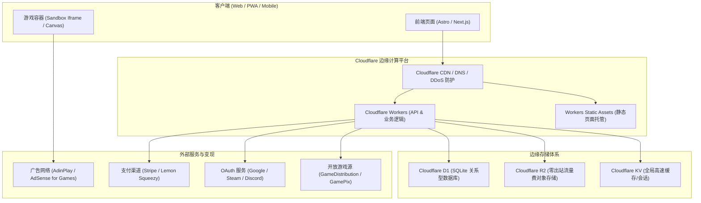
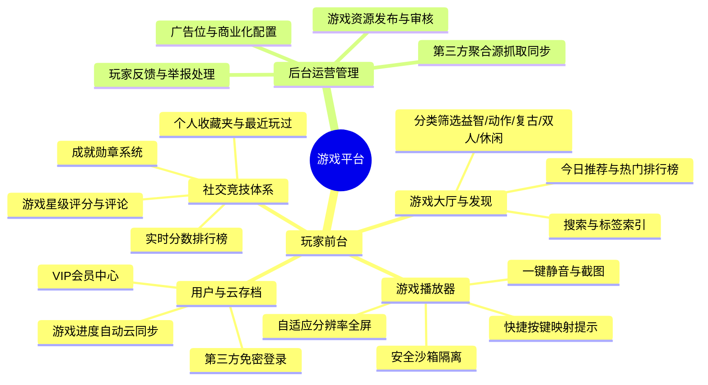
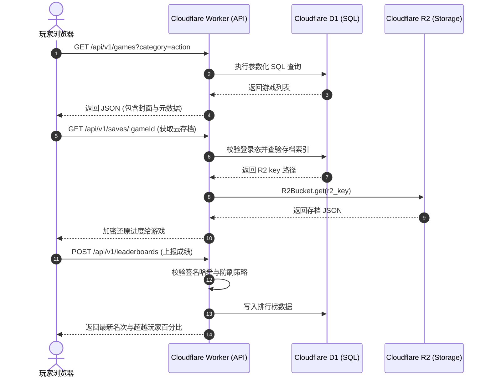

# 游戏平台（EdgePlay）网站规划与技术开发规范

> [!NOTE]
> 本规划文档专为依托 **Cloudflare 边缘云计算生态（Workers + D1 + R2）** 打造的高性能、低成本、高并发独立游戏网站而设计。涵盖产品规划、系统架构、数据库与存储设计、API 规范、安全策略及阶段实施路线图。

---

## 1. 网站定位与核心目标

### 1.1 产品定位
- **定位**：轻量级、跨终端（PC/Mobile/Tablet）即点即玩的出海/全球化 HTML5 与 WebGL 休闲游戏聚合及玩家社区平台。
- **核心体验**：
  - **秒级加载**：依托 Cloudflare 全球 300+ 边缘数据中心节点就近缓存与分发。
  - **免安装畅玩**：纯浏览器原生运行，支持 PWA（渐进式 Web 应用）桌面一键安装。
  - **跨端进度漫游**：跨设备无缝同步游戏进度与云存档。
  - **社交化竞技**：全球/区域排行榜、成就挑战与玩家社区互动。

---

## 2. 整体系统技术架构

系统采用全面的 **Serverless 边缘优先架构**，杜绝传统单体服务器的高昂闲置运维与带宽成本。



### 技术选型清单
| 层次 | 选型技术 | 核心优势 |
| :--- | :--- | :--- |
| **前端框架** | **Astro + Tailwind CSS**（推荐）或 Next.js | 极致的静态构建（SSG）性能，极高 SEO 得分，原生支持局部 Hydration |
| **边缘服务** | **Cloudflare Workers** | 冷启动时间接近 0ms，全球多点并发，代码体积轻量 |
| **静态托管** | **Workers Static Assets** | 官方最新推荐标准，取代传统 Pages，与 Worker 逻辑无缝集成 |
| **关系数据库**| **Cloudflare D1 (SQLite)** | 边缘分布式只读复制，原生支持事务与 SQL 查询，极低延迟 |
| **对象存储** | **Cloudflare R2 (S3 兼容)** | **免出站流量费（Zero Egress）**，海量托管游戏 zip/图片，成本可控 |
| **身份认证** | **JWT / Supabase Auth / Clerk / 纯 Worker OAuth** | 边缘无状态鉴权，降低数据库查询压力 |

---

## 3. 前台与核心功能模块设计



### 3.1 核心功能特性明细
1. **游戏播放器沙箱隔离**：
   - 采用 `<iframe sandbox="allow-scripts allow-same-origin allow-pointer-lock allow-fullscreen">` 严格隔离第三方游戏代码，防止 Cookie 劫持或恶意跳转。
2. **跨端云存档同步引擎**：
   - 封装统一的 `EdgePlay SDK` 注入到游戏环境中，自动代理或监听游戏内部的 `localStorage` 变化。
   - 当检测到游戏数据变动或关卡结束时，自动压缩上传至 D1（小型存档）或 R2（大体积存档）。
3. **全球/周榜排行榜（Leaderboards）**：
   - 带有防作弊哈希校验（HMAC 签名）的成绩上报接口，避免玩家直接通过脚本篡改高分。

---

## 4. 数据库设计（Cloudflare D1 SQLite）

以下为生产级表结构设计脚本（`schema.sql`）：

```sql
-- 1. 用户表
CREATE TABLE IF NOT EXISTS users (
    id TEXT PRIMARY KEY,                       -- UUID 或 OAuth UID
    username TEXT NOT NULL,
    email TEXT UNIQUE,
    avatar_url TEXT,
    role TEXT DEFAULT 'player',                 -- 'player', 'creator', 'admin'
    is_vip INTEGER DEFAULT 0,                  -- 0: 普通用户, 1: VIP会员
    vip_expires_at DATETIME,
    created_at DATETIME DEFAULT CURRENT_TIMESTAMP,
    updated_at DATETIME DEFAULT CURRENT_TIMESTAMP
);

-- 2. 游戏元数据表
CREATE TABLE IF NOT EXISTS games (
    id TEXT PRIMARY KEY,                       -- 唯一标识符，如 'space-invader-3d'
    slug TEXT UNIQUE NOT NULL,                 -- URL 友好别名，如 'space-invader-3d'
    title TEXT NOT NULL,
    description TEXT,
    category TEXT NOT NULL,                    -- 'action', 'puzzle', 'retro', 'arcade', etc.
    tags TEXT,                                 -- JSON 数组，如 '["2D", "Retro", "Pixel"]'
    developer TEXT,                            -- 开发者名称或版权方
    source_type TEXT DEFAULT 'self_hosted',     -- 'self_hosted', 'gamedistribution', 'gamepix'
    entry_url TEXT NOT NULL,                   -- 游戏入口地址（R2 托管路径或第三方外部 URL）
    thumbnail_url TEXT NOT NULL,               -- 封面图 URL
    orientation TEXT DEFAULT 'all',            -- 'landscape', 'portrait', 'all'
    play_count INTEGER DEFAULT 0,
    rating_avg REAL DEFAULT 5.0,
    rating_count INTEGER DEFAULT 0,
    status TEXT DEFAULT 'published',           -- 'draft', 'published', 'archived'
    is_featured INTEGER DEFAULT 0,             -- 是否推荐位
    created_at DATETIME DEFAULT CURRENT_TIMESTAMP
);
CREATE INDEX IF NOT EXISTS idx_games_category ON games(category);
CREATE INDEX IF NOT EXISTS idx_games_plays ON games(play_count DESC);
CREATE INDEX IF NOT EXISTS idx_games_status ON games(status);

-- 3. 游戏排行榜表
CREATE TABLE IF NOT EXISTS leaderboards (
    id INTEGER PRIMARY KEY AUTOINCREMENT,
    game_id TEXT NOT NULL,
    user_id TEXT NOT NULL,
    score INTEGER NOT NULL,
    score_display TEXT,                        -- 格式化展示，如 "01:23.45" 或 "120,400 pts"
    created_at DATETIME DEFAULT CURRENT_TIMESTAMP,
    FOREIGN KEY (game_id) REFERENCES games(id) ON DELETE CASCADE,
    FOREIGN KEY (user_id) REFERENCES users(id) ON DELETE CASCADE
);
CREATE INDEX IF NOT EXISTS idx_leaderboards_game_score ON leaderboards(game_id, score DESC);

-- 4. 玩家云存档索引表
CREATE TABLE IF NOT EXISTS game_saves (
    id INTEGER PRIMARY KEY AUTOINCREMENT,
    user_id TEXT NOT NULL,
    game_id TEXT NOT NULL,
    slot_id INTEGER DEFAULT 1,                 -- 存档槽位（默认为1）
    r2_key TEXT NOT NULL,                      -- 存储在 R2 的具体 key，如 'saves/usr_123/game_456_s1.json'
    file_size INTEGER DEFAULT 0,               -- 存档大小（字节）
    summary TEXT,                              -- 存档描述（关卡名称、等级等）
    updated_at DATETIME DEFAULT CURRENT_TIMESTAMP,
    UNIQUE(user_id, game_id, slot_id),
    FOREIGN KEY (user_id) REFERENCES users(id) ON DELETE CASCADE,
    FOREIGN KEY (game_id) REFERENCES games(id) ON DELETE CASCADE
);

-- 5. 收藏夹与游玩历史表
CREATE TABLE IF NOT EXISTS user_game_activities (
    id INTEGER PRIMARY KEY AUTOINCREMENT,
    user_id TEXT NOT NULL,
    game_id TEXT NOT NULL,
    is_favorite INTEGER DEFAULT 0,             -- 是否收藏
    last_played_at DATETIME,
    play_time_seconds INTEGER DEFAULT 0,       -- 累计游玩时长
    UNIQUE(user_id, game_id),
    FOREIGN KEY (user_id) REFERENCES users(id) ON DELETE CASCADE,
    FOREIGN KEY (game_id) REFERENCES games(id) ON DELETE CASCADE
);

-- 6. 游戏评价与评论表
CREATE TABLE IF NOT EXISTS game_reviews (
    id INTEGER PRIMARY KEY AUTOINCREMENT,
    game_id TEXT NOT NULL,
    user_id TEXT NOT NULL,
    rating INTEGER CHECK(rating >= 1 AND rating <= 5),
    content TEXT,
    created_at DATETIME DEFAULT CURRENT_TIMESTAMP,
    FOREIGN KEY (game_id) REFERENCES games(id) ON DELETE CASCADE,
    FOREIGN KEY (user_id) REFERENCES users(id) ON DELETE CASCADE
);
```

---

## 5. Cloudflare R2 对象存储设计

R2 的最大优势是**无外网出站流量费**，特别适合游戏网站这种需要频繁下载静态大型资产（美术资源、WebGL Bundle、音乐音效、ROM）的场景。

### 5.1 存储桶目录层级
```text
game-assets-bucket/
├── games/                             # 游戏静态资源包
│   ├── flappy-bird/
│   │   ├── index.html
│   │   ├── game.js
│   │   └── assets/
│   └── 2048/
├── covers/                            # 封面与缩略图 (WebP 格式优化)
│   ├── flappy-bird.webp
│   └── 2048.webp
├── saves/                             # 玩家大体积云存档 (加密/压缩 JSON)
│   └── {user_id}/
│       └── {game_id}_{slot}.json
└── avatars/                           # 用户自定义头像
    └── {user_id}.webp
```

### 5.2 访问与缓存控制策略
- **公共资源（游戏文件、封面）**：
  - 绑定专属自定义域名（如 `cdn.yourgamehub.com`），并配置 Cloudflare CDN Cache 规则，设置 `Cache-Control: public, max-age=31536000, immutable`。
- **私有资源（云存档）**：
  - 不开放公网直接访问，必须由 Worker 鉴权后通过 R2 Binding 进行读取，或签发限时预签名 URL（Presigned URL）。

---

## 6. 核心 API 规范设计

所有 API 均运行在 Cloudflare Workers 边缘计算节点，路径前缀为 `/api/v1`：



### 常用接口一览
| 路径 | 方法 | 鉴权要求 | 说明 |
| :--- | :--- | :--- | :--- |
| `/api/v1/games` | GET | 无 | 获取游戏列表（支持分页、类别、排序、搜索） |
| `/api/v1/games/:slug` | GET | 无 | 获取指定游戏详情及启动入口配置 |
| `/api/v1/games/:id/play` | POST | 无 | 增加游戏游玩计数（防刷流控） |
| `/api/v1/leaderboards/:gameId` | GET | 无 | 获取该游戏排行榜 Top 50 及当前用户排位 |
| `/api/v1/leaderboards/:gameId` | POST | 必须 | 上报游戏结算分数（携带防作弊 Token） |
| `/api/v1/saves/:gameId` | GET | 必须 | 获取当前玩家该游戏的云存档 |
| `/api/v1/saves/:gameId` | PUT | 必须 | 更新/上传当前玩家的云存档 |
| `/api/v1/user/favorites` | GET/POST | 必须 | 获取或切换收藏状态 |

---

## 7. 商业化变现与收益闭环

为了实现高流量向收益的稳健转化，平台设计**三级变现火箭模型**：

```
                    ┌─────────────────────────┐
                    │    三级: VIP会员订阅     │  (Stripe / Lemon Squeezy: 去广告、无限存档、专属特权)
                    ├─────────────────────────┤
                    │    二级: 游戏联运分成    │  (GameDistribution / GamePix 游戏内广告 50% 分成)
                    ├─────────────────────────┤
                    │    一级: 原生/展示广告   │  (AdinPlay 游戏前贴片广告 + 激励视频 + Banner)
                    └─────────────────────────┘
```

1. **游戏广告层（底层流量变现）**：
   - 接入 **AdinPlay** 或 **Google AdSense for Games (AFG)**：
     - **Preroll（游戏开始前贴片）**：点击“开始游戏”时播放 5~15 秒视频。
     - **Rewarded Video（激励视频）**：游戏内复活、获取道具时由玩家主动触发。
     - **Display Banner（侧边/底栏横幅）**：游戏画布外围自然展示，不影响操作。
2. **游戏联运分成**：
   - 平台作为分发渠道，聚合 GameDistribution / Famobi 的官方 SDK，按月获得游戏内产生的广告分成结算。
3. **VIP 会员订阅体系**：
   - **月度 / 年度订阅**：
     - 全平台屏蔽所有贴片与弹窗广告。
     - 开启大容量云存档（多槽位自由切换）。
     - 获得专属论坛/排行榜头像框与金色昵称。

---

## 8. 安全规范与沙箱机制

> [!CAUTION]
> 游戏平台允许嵌入第三方代码和玩家提交内容，必须实行最高等级的安全隔离。

1. **Iframe 沙箱权限控制**：
   - 禁用 `allow-top-navigation`（防止恶意游戏劫持父页面重定向到钓鱼网站）。
   - 禁用 `allow-popups` 或严格受限（防止未授权广告弹窗）。
2. **防作弊签名机制（Score Anti-Cheat）**：
   - 游戏加载时，Worker 生成一个包含 `game_id`、`user_id`、`timestamp`、`nonce` 的一次性 HMAC 签名密钥。
   - 结算时，客户端将加密校验串与分数一起提交，防止抓包直接修改数字。
3. **内容安全策略（CSP - Content Security Policy）**：
   - 配置 HTTP 响应头严格限制脚本加载来源，杜绝内联恶意注入。

---

## 9. 阶段实施路线图（Milestones）

| 阶段 | 周期 | 核心目标 | 交付产物 |
| :--- | :--- | :--- | :--- |
| **阶段 1：底座搭建** | 第 1 周 | 基础设施与本地开发流打通 | • 初始化 Astro / Next.js 前端<br>• 配置 `wrangler.json` 关联 D1 与 R2<br>• 执行 D1 初始 `schema.sql` 迁移 |
| **阶段 2：核心浏览与播放** | 第 2 周 | 实现可玩游戏大厅与播放器 | • 首页分类、标签与卡片列表<br>• 响应式游戏详情页与全屏 Iframe 沙箱播放器<br>• 上传 5~10 款开源精品 WebGL 游戏至 R2 验证 |
| **阶段 3：用户系统与存档** | 第 3 周 | 建立玩家粘性功能 | • 接入 OAuth 免密登录与 JWT<br>• 实现 D1 排行榜查询与上传<br>• 实现跨端云存档同步与读取 |
| **阶段 4：商业化与聚合源** | 第 4 周 | 流量变现与规模化扩充游戏 | • 接入 AdinPlay / AdSense 广告位 SDK<br>• 接入第三方游戏 API（自动同步上千款游戏）<br>• 接入 Stripe VIP 订阅支付通道 |
| **阶段 5：全球上线与 SEO** | 第 5 周 | 性能压测、PWA 与搜索引擎优化 | • 生成 Dynamic Sitemap 与 Schema.org 结构化数据<br>• 配置 Service Worker 实现 PWA 与离线缓存<br>• 绑定独立域名并上线 Cloudflare 全球节点 |
